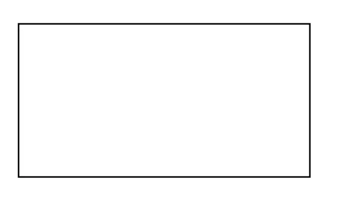

# 考核

## 简答

1. 请列出三大家族成员，并写出其检测盒子宽高的区别？

   

2. 写出获取滚动条卷入高度的方法

   

3. 如何判断一个变量是数组类型，请写出你已知的判断方法

   

4. 请写出获取元素行内样式、内联样式、外联样式的方法

   

5. 请写出HTML5新的存储值属性？并列出详细的方法

   

6. 请写一个正则表达式，校验日期格式：年-月-日  例如：2016-08-20 为true 2016/08/20 为false


7. 事件委托是什么？为什么要使用它？

   

8. 什么是防抖和节流？有什么区别？如何实现？


9. 随机数范围 [6-56]，请用两种方式实现


10. 什么是浏览器的同源政策？


11. 简述你对call、apply、bind方法的理解


## 判断输出值

**1）**

```javascript
var uname = "张三";
function fn(){
	var uname = "李四";
	function gn(){
		return this.uname;
	}
	return gn();
}

fn();  // ?
```

**2）**

```JavaScript
var a = 100;
function fn(){
	console.log(a);  // ?
	a = 10;
	console.log(a);  // ?
}
fn();
console.log(a);  // ?
```

**3）**

```js
var name = 'Tom';
(function() {
    if (typeof name == 'undefined') {
        var name = 'Jack';
        console.log('Goodbye ' + name);
    } else {
        console.log('Hello ' + name);
    }
})();
// ?
```

**4)**

```js
"11" == String("11");  // ?
"11" === String("11");  // ?
String('11') == new String('11');  // ?
String('11') === new String('11');  // ?
```

**5)**

```js
function Foo() {
    Foo.a = function() {
        console.log(1)
    }
    this.a = function() {
        console.log(2)
    }
}
Foo.prototype.a = function() {
    console.log(3)
}
Foo.a = function() {
    console.log(4)
}

Foo.a();  // ?
let obj = new Foo();
obj.a();  // ?
Foo.a();  // ?
```


## 分析实践

1. 用事件委托的方式实现点击页面内任何 p 标签，标签内文本颜色变蓝。如果标签内部带有任何子元素，则子元素内文本颜色变红。

2. 请写出对象浅拷贝的方法及深拷贝的方法

3. 请写一个函数，将数字的整数位以千分位分隔 例如: fn(1234567) ==> "1,234,567"  fn(12345.67) ==> "12,345.67"

4. 请用方法求出某个字符串中出现最多的字符和个数，例如：`fn("abcabcbbccccc")`，log：字符最多的是 c，出现了 7 次

5. 封装方法将字符串转化为驼峰命名 例如：`var s1 = "get-element-by-id"  ===>  getElementById`

6. 实现一个方法render，可以将字符串中双花括号变量变成传入的对象对应属性名的属性值，如下所示

   ```js
   let template = '我是{{name}}，年龄{{age}}，性别{{sex}}';
   let data = {
     name: '姓名',
     age: 18
   }
   
   render(template, data); // 返回值：我是姓名，年龄18，性别undefined
   ```


**附加题**

1、请根据文件夹内的imgData.js中的src数组（数组长度100）实现横向瀑布流，要求按行加载，每行4或5张图片，图片来源是从图片数组中随机出来，初始化加载出滚动条，然后滚动条距离页面底部100添加内容，请使用节流函数包装滚动行为。如文件夹中的 webm 文件所示。

> 提示：
>
> 1、在图片的 onload 函数中，可以通过 this.width/height 来获取图片的原图大小
>
> 2、实现方式：先将每行内的图片以原图宽高比 和 固定的高度，比如150求出相同高度下每张图片的宽度，然后再将行内所有图片的宽度加起来与容器的宽度1200对比，求出其占满盒子的比例如下图：



2、请结合之前所学拖拽和web轮播以及移动端轮播的相关知识，写出手动拖拽的无缝轮播。如文件夹中 webm 文件所示：左右拖拽距离超过盒子宽的 1/3，即进行左右的轮播转换，如不超过，则返回原状。实现分为4级：

1. 简单的拖拽轮播，没有loop循环，无小点或无点击事件
2. 简单的拖拽轮播，没有loop循环，添加了小点及其点击事件
3. loop循环轮播，无小点或无小点点击事件
4. loop循环轮播，添加了小点及其点击事件
5. 封装成插件，可被 new 创建  （此项达到算考分200分，有神秘惊喜）


